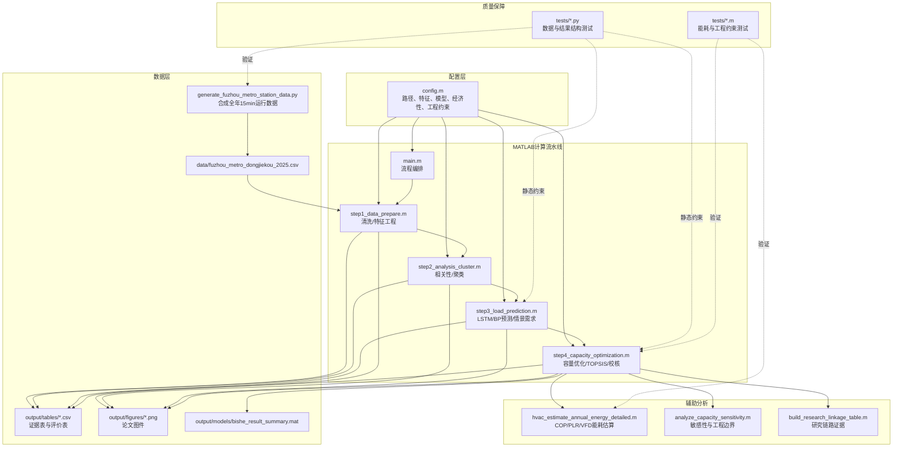
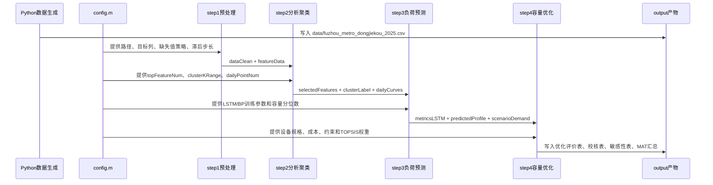
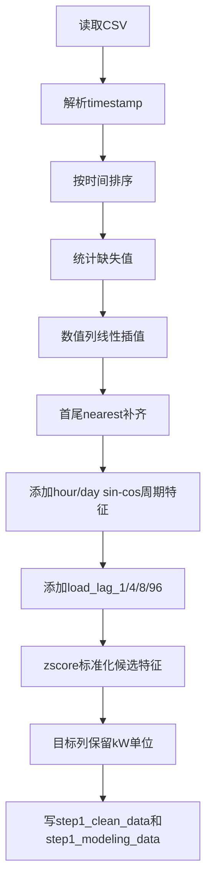
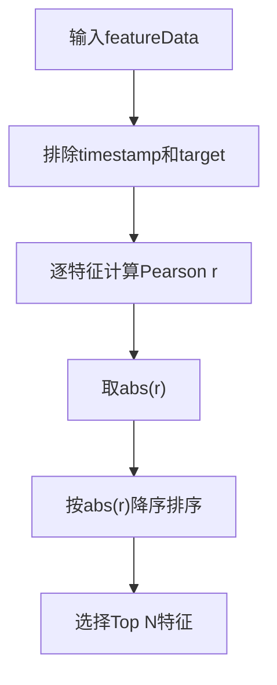
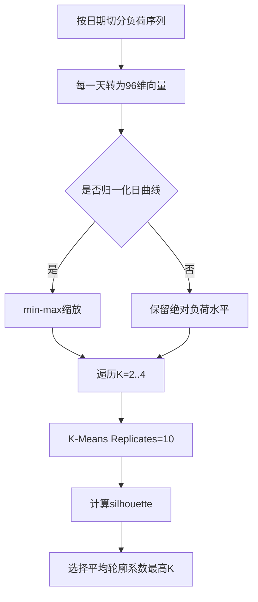
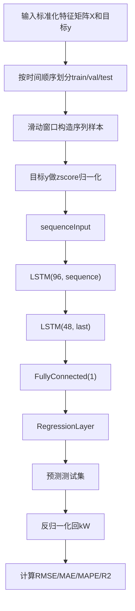
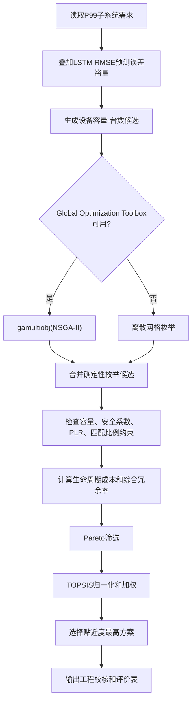

# 地铁车站环控系统容量优化项目技术分析文档

生成日期：2026-05-22  
分析范围：`main.m`、`config.m`、`step1_data_prepare.m`、`step2_analysis_cluster.m`、`step3_load_prediction.m`、`step4_capacity_optimization.m`、`generate_fuzhou_metro_station_data.py`、辅助 MATLAB 函数、测试用例与 `output/tables` 当前结果。  
验证状态：`pytest -q` 通过 12 项测试，用时 4.60 s；MATLAB R2022b `runtests('tests')` 通过 2 项 MATLAB 单元测试，其中 `test_step4_engineering_constraints` 中步骤4测试耗时约 5.0 s。

## 目录

1. [项目概述](#1-项目概述)
2. [项目整体架构设计](#2-项目整体架构设计)
3. [核心功能模块实现分析](#3-核心功能模块实现分析)
4. [关键算法分析](#4-关键算法分析)
5. [数据结构选型分析](#5-数据结构选型分析)
6. [API 接口设计规范与使用文档](#6-api-接口设计规范与使用文档)
7. [代码风格规范与最佳实践](#7-代码风格规范与最佳实践)
8. [性能与架构优化建议](#8-性能与架构优化建议)

## 1. 项目概述

### 1.1 项目背景

本项目面向“计及客流特性的地铁车站环控系统节能策略研究 / 地铁车站通风空调系统容量配置优化”场景。地铁车站 HVAC（通风空调）系统常按峰值负荷和安全裕量进行设备选型，容易造成装机偏大、部分负荷运行效率低、长期能耗偏高等问题。项目通过构造福州地铁东街口站 2025 年 15 分钟粒度运行数据，形成从数据预处理、负荷特性分析、负荷预测到容量优化与工程校核的完整研究链路。

### 1.2 项目目标

- 生成可复现实验数据集：全年 365 天、15 分钟粒度，共 `365 * 24 * 4 = 35040` 条记录。
- 从客流、气象、站内环境、时间周期和历史负荷中筛选影响因素。
- 使用 K-Means 识别典型日负荷模式，辅助理解运行工况。
- 建立 LSTM 负荷预测模型，并与 BP 神经网络进行对比。
- 将 LSTM 预测曲线转换为 P50/P95/P99 等容量设计情景。
- 对冷机、风机、水泵、AHU 进行容量组合优化，并通过 TOPSIS 选择推荐方案。
- 输出论文可引用的 CSV 表、PNG 图、MAT 汇总文件和 DOCX 论文草稿。

### 1.3 技术栈选型

| 层面 | 技术 | 用途 |
| --- | --- | --- |
| 主计算环境 | MATLAB R2022b | 数据预处理、统计分析、模型训练、容量优化、图表输出 |
| MATLAB 工具箱 | Statistics and Machine Learning Toolbox | `fitlm`、`kmeans`、`silhouette`、统计指标 |
| MATLAB 工具箱 | Deep Learning Toolbox | `trainNetwork`、`lstmLayer` 训练 LSTM |
| MATLAB 工具箱 | Neural Network Toolbox | `fitnet` 训练 BP 对比模型 |
| MATLAB 工具箱 | Global Optimization Toolbox | `gamultiobj` 执行 NSGA-II；不可用时回退到离散枚举 |
| Python | Python 3.12、NumPy、Pandas | 合成地铁车站全年运行数据 |
| 测试 | pytest、MATLAB Unit Test | 数据生成、约束、结果结构和工程辅助函数测试 |
| 文档生成 | python-docx 相关脚本 | 将中间 Markdown/结果表写入论文 DOCX |

### 1.4 整体功能架构概述

项目以 `main.m` 为主入口，`config.m` 提供全局配置，四个 `step*.m` 文件组成顺序执行的数据科学流水线：

1. `step1_data_prepare.m`：读取 CSV、时间排序、缺失值填补、时间特征和滞后特征构造、标准化建模表输出。
2. `step2_analysis_cluster.m`：Pearson 相关性排序、分项负荷占比分析、逐日曲线聚类。
3. `step3_load_prediction.m`：LSTM/BP 预测、聚类标签消融、公平特征对比、子系统需求换算。
4. `step4_capacity_optimization.m`：P99 需求叠加预测误差裕量，执行 NSGA-II 或离散枚举，使用 TOPSIS 排序，生成工程校核表。

## 2. 项目整体架构设计

### 2.1 系统架构图



### 2.2 分层职责与交互机制

| 层 | 主要文件 | 职责 | 交互机制 |
| --- | --- | --- | --- |
| 数据生成层 | `generate_fuzhou_metro_station_data.py` | 生成全年客流、气象、站内环境、分项负荷和设备运行数据 | 输出 UTF-8 BOM CSV 到 `data/` |
| 配置层 | `config.m` | 集中维护路径、特征列表、训练超参数、经济性假设和工程约束 | 所有 MATLAB 步骤通过 `cfg` 结构体读取配置 |
| 流程编排层 | `main.m` | 顺序调用四个步骤并保存汇总 MAT | 通过函数返回值传递 `dataClean`、`analysisResult`、`predictionResult` |
| 数据处理层 | `step1_data_prepare.m` | 清洗缺失值、构造周期时间特征和滞后负荷特征 | 输出 `dataClean` 与 `featureData`，写 `step1_*.csv` |
| 分析建模层 | `step2_analysis_cluster.m`、`step3_load_prediction.m` | 特征筛选、聚类、LSTM/BP 训练、子系统需求换算 | `analysisResult` 进入预测步骤，`predictionResult` 进入优化步骤 |
| 优化决策层 | `step4_capacity_optimization.m` | 容量组合搜索、工程约束、TOPSIS 决策、能耗和成本评估 | 输出 `optimizationResult` 与多张工程证据表 |
| 质量保障层 | `tests/` | 回归测试数据生成、工程约束和结果可信性 | pytest + MATLAB Unit Test |
| 文档产物层 | `scripts/*.py`、`output/*.docx` | 将结果表、图件与论文文本组织成 DOCX | 读取 `output/tables` 与 `output/figures` |

### 2.3 数据流方向



### 2.4 架构设计原则与设计模式

- **配置驱动**：路径、特征、模型超参数、设备规格和工程约束集中在 `config.m`，减少在流程代码中硬编码实验假设。
- **流水线分层**：`main.m` 只做编排，业务计算分别封装到 `step1` 至 `step4`，每一步都有明确输入输出。
- **数据契约优先**：中间结果以 MATLAB `table`、`struct` 和 CSV 表保存，保证论文表格、测试和二次开发可以复用同一批结果。
- **可复现性**：Python 生成器和 MATLAB 聚类均使用固定随机种子 `202507`。
- **降级策略模式**：LSTM、BP、NSGA-II 都有工具箱不可用时的替代路径，例如移动平均、线性回归、离散枚举。
- **证据表驱动写作**：每个研究结论都尽量落到 `output/tables` 中的可审查 CSV，避免只在论文正文中描述。

## 3. 核心功能模块实现分析

### 3.1 主入口与流程编排模块

**文件**：`main.m`  
**核心职责**：初始化全局图形解释器、读取配置、创建输出目录、按顺序执行四个步骤并保存汇总结果。

**业务价值**：把数据科学流程固化为可重复执行的端到端管线，降低手动运行单个脚本造成的数据错配风险。

**关键代码片段**：`main.m:34-58`

```matlab
% 步骤1将原始 CSV 转换为清洗后的数据表和标准化特征矩阵，后续步骤依赖 dataClean 和 featureData。
[dataRaw, dataClean, featureData] = step1_data_prepare(cfg);

% 步骤2分析负荷影响因素并提取典型日负荷模式，其特征选择和聚类结果将进入预测步骤。
analysisResult = step2_analysis_cluster(cfg, dataClean, featureData);

% 步骤3训练负荷预测模型，并将总冷负荷预测结果转换为各子系统容量需求情景。
predictionResult = step3_load_prediction(cfg, featureData, dataClean, analysisResult);

% 步骤4搜索可行设备容量方案，并在 Pareto 优化后用 TOPSIS 选择推荐方案。
optimizationResult = step4_capacity_optimization(cfg, predictionResult, analysisResult);

% 保存汇总 MAT 文件，便于不重新运行全流程时复查或复现论文图表。
save(resultFile, "cfg", "dataRaw", "dataClean", "featureData", ...
    "analysisResult", "predictionResult", "optimizationResult");
```

**实现说明**：

- `main.m:10-12` 调用 `config()` 并启动总计时器。
- `main.m:14-26` 在写表、写图、写模型前创建输出目录。
- `main.m:34-51` 将四个步骤串成严格顺序数据流。
- `main.m:54-58` 保存全量结果，支撑后续论文生成、结果复查和调试。

**接口定义**：

| 输入 | 输出 | 下游 |
| --- | --- | --- |
| `cfg = config()` | `bishe_result_summary.mat` | 论文图表复查、优化结果复现 |
| `data/*.csv` | `output/tables/*.csv`、`output/figures/*.png` | 论文和测试 |

### 3.2 集中配置模块

**文件**：`config.m`  
**核心职责**：维护全流程共享配置，包括数据路径、目标列、特征列表、聚类候选 K、LSTM/BP 参数、NSGA-II 参数、设备候选规格、经济性假设、容量安全系数和 TOPSIS 权重。

**业务价值**：将实验假设和工程参数集中管理，使复现实验、敏感性分析和论文答辩修改更可控。

**关键代码片段**：`config.m:76-103`、`config.m:113-163`

```matlab
% 按时间顺序划分：前段训练，中段验证，末段测试。
cfg.trainRatio = 0.7;
cfg.valRatio = 0.2;
cfg.testRatio = 0.1;

% LSTM 序列长度为16个15分钟步长，即4小时历史窗口。
cfg.sequenceLength = 16;
cfg.lstmHiddenUnits = [96, 48];
cfg.maxEpochs = 120;
cfg.miniBatchSize = 32;

% 工程约束：最小部分负荷率、极端裕量和子系统匹配范围。
cfg.minTypicalChillerPLR = 0.28;
cfg.minExtremeCapacityMargin = 0.03;
cfg.predictionErrorRmseFactor = 1.0;
cfg.fanCoolingCapacityRatioRange = [0.05, 0.09];
cfg.pumpCoolingCapacityRatioRange = [0.045, 0.08];
cfg.ahuAirflowPerCoolingKwRange = [260, 360];

% TOPSIS 权重：全生命周期成本、冗余率。
cfg.topsisWeights = [0.55, 0.45];
```

**技术难点**：

- 同时管理数据科学参数与工程设计参数，命名必须清晰区分“模型训练假设”和“设备选型约束”。
- 安全系数、P99 分位数、预测误差裕量之间存在耦合，后续维护时应避免在多个文件重复定义。

### 3.3 数据生成模块

**文件**：`generate_fuzhou_metro_station_data.py`  
**核心职责**：合成福州地铁东街口站全年 15 分钟粒度数据，覆盖客流、气象、站内环境、分项冷负荷和设备侧负荷。

**业务价值**：在缺少真实 BMS/AFC 数据时，为论文方法链提供可复现、结构完整、具有季节性和客流峰谷特征的数据源。

**关键代码片段**：`generate_fuzhou_metro_station_data.py:104-151`

```python
def generate_station_data(
    station: str = "Dongjiekou Station",
    line: str = "Fuzhou Metro Line 1/Line 4 Interchange",
    seed: int = 202507,
    missing_rate: float = 0.006,
) -> pd.DataFrame:
    rng = np.random.default_rng(seed)
    timestamps = pd.date_range("2025-01-01 00:00:00", "2025-12-31 23:45:00", freq="15min")
    data = pd.DataFrame({"timestamp": timestamps})
    ...
    entry_base, exit_base = flow_profile(hour_float, day_type)
    daily_factor = 1.0 + 0.035 * np.sin(2 * np.pi * (day_index - 1) / 7)
    ...
    data["platform_passengers"] = np.rint((rolling_people * stay_ratio).clip(3)).astype(int)
```

**实现说明**：

- `generate_fuzhou_metro_station_data.py:111` 创建全年 15 分钟时间轴。
- `generate_fuzhou_metro_station_data.py:25-35` 将日期划分为 `weekday_high`、`weekday_medium`、`weekend_single`、`low_flow`。
- `generate_fuzhou_metro_station_data.py:49-84` 用高斯峰和 Sigmoid 平台构造早晚高峰、周末单峰、低流量日等客流形态。
- `generate_fuzhou_metro_station_data.py:181-242` 将人员、新风、围护结构和设备负荷叠加为总冷负荷，并生成冷机、风机、水泵负荷。
- `generate_fuzhou_metro_station_data.py:87-101` 按 `missing_rate` 向关键列注入缺失值，用于验证预处理。

**接口与交互**：

- 输出文件：`data/fuzhou_metro_dongjiekou_2025.csv`
- 下游读取：`step1_data_prepare.m:15` 使用 `readtable` 读取该 CSV。
- 测试约束：`tests/test_generate_fuzhou_metro_station_data.py:20-30` 验证全年长度、时间起止和采样间隔。

### 3.4 数据预处理与特征工程模块

**文件**：`step1_data_prepare.m`  
**核心职责**：读取 CSV、解析时间、排序、填补缺失值、添加时间周期特征和负荷滞后特征，并构建标准化建模表。

**业务价值**：为 Pearson 分析、聚类和预测模型提供一致、无缺失、按时间排序的输入数据，避免后续模型因时间错序或尺度差异产生偏差。

**关键代码片段**：`step1_data_prepare.m:120-194`

```matlab
function dataClean = fillMissingValues(dataRaw, cfg)
numericVars = dataClean.Properties.VariableNames(varfun(@isnumeric, dataClean, "OutputFormat", "uniform"));
for i = 1:numel(numericVars)
    varName = numericVars{i};
    % 先线性插值，再用最近值补齐首尾无法插值的 NaN。
    dataClean.(varName) = fillmissing(dataClean.(varName), cfg.missingMethod);
    dataClean.(varName) = fillmissing(dataClean.(varName), "nearest");
end
end

function dataOut = addLoadLagFeatures(dataIn, cfg)
target = dataOut.(cfg.targetName);
for i = 1:numel(cfg.loadLagSteps)
    lagStep = cfg.loadLagSteps(i);
    lagName = "load_lag_" + string(lagStep);
    lagValues = [nan(lagStep, 1); target(1:end - lagStep)];
    lagValues = fillmissing(lagValues, "nearest");
    dataOut.(lagName) = lagValues;
end
end
```

**技术难点**：

- 时间序列建模不能随机打乱数据，因此预处理必须保留时间顺序。
- 滞后特征会造成开头缺失，当前实现用最近值填补以保持表长度不变。
- 周期时间特征用 `sin/cos` 编码，避免 23:45 与 00:00 在普通数值编码中被错误视为距离很远。

**模块输出**：

| 输出变量/文件 | 类型 | 说明 |
| --- | --- | --- |
| `dataRaw` | MATLAB `table` | 完成时间戳解析后的原始数据 |
| `dataClean` | MATLAB `table` | 排序、补缺、添加时间/滞后特征后的数据 |
| `featureData` | MATLAB `table` | 标准化特征表，目标列保留 kW 物理单位 |
| `output/tables/step1_clean_data.csv` | CSV | 清洗后数据 |
| `output/tables/step1_modeling_data.csv` | CSV | 建模数据 |

### 3.5 负荷影响因素分析与典型日聚类模块

**文件**：`step2_analysis_cluster.m`  
**核心职责**：计算 Pearson 相关性、负荷分项占比、构造日负荷曲线矩阵、遍历 K-Means 候选 K 并按平均轮廓系数选择最优聚类数。

**业务价值**：将“哪些因素影响负荷”和“负荷运行模式如何分组”转化为可解释证据，服务后续特征筛选和论文结论。

**关键代码片段**：`step2_analysis_cluster.m:122-160`

```matlab
function correlationTable = rankPearsonFeatures(cfg, featureData)
featureNames = setdiff(varNames, [cfg.timestampName, cfg.targetName], "stable");
target = featureData.(cfg.targetName);
for i = 1:numel(featureNames)
    values = featureData.(featureNames(i));
    % Rows="complete" 忽略特征或目标中存在 NaN 的样本。
    r = corr(values, target, "Rows", "complete", "Type", "Pearson");
    pearsonR(i) = r;
    absPearsonR(i) = abs(r);
end
correlationTable = sortrows(table(feature, pearsonR, absPearsonR), "absPearsonR", "descend");
end
```

**关键代码片段**：`step2_analysis_cluster.m:162-211`

```matlab
function [dailyCurves, dailyDates] = buildDailyLoadCurves(cfg, dataClean)
dailyCurves = nan(numel(dailyDates), cfg.dailyPointNum);
for i = 1:numel(dailyDates)
    dayLoad = dataClean.(cfg.targetName)(idx);
    curve(1:n) = dayLoad(1:n);
    curve = fillmissing(curve, "linear", 2);
    curve = fillmissing(curve, "nearest", 2);
    dailyCurves(i, :) = curve;
end
end

function [bestK, bestLabel, silhouetteTable] = chooseBestClusterK(cfg, dailyCurves)
for i = 1:numel(kValues)
    labels{i} = kmeans(dailyCurves, k, "Replicates", 10, "MaxIter", 1000);
    s = silhouette(dailyCurves, labels{i});
    meanSilhouette(i) = mean(s, "omitnan");
end
[~, bestIdx] = max(meanSilhouette);
bestK = kValues(bestIdx);
end
```

**当前输出证据**：

| 指标 | 当前结果 |
| --- | --- |
| 最优 K | `4` |
| K=4 平均轮廓系数 | `0.679655` |
| Top 1 特征 | 冷负荷滞后1步，Pearson `0.986148` |
| Top 5 特征 | 冷负荷滞后1步、冷负荷滞后4步、站台人数、冷负荷滞后8步、进站客流 |
| 主要分项负荷占比 | 围护结构负荷约 `49.997%`，设备负荷约 `31.959%` |

### 3.6 负荷预测与情景需求模块

**文件**：`step3_load_prediction.m`  
**核心职责**：基于 `analysisResult.selectedFeatures` 构建建模矩阵，训练 LSTM 与 BP 模型，开展聚类标签消融和公平输入对比，并把总冷负荷预测曲线转换为子系统容量需求情景。

**业务价值**：把统计分析结果转换为可用于容量优化的连续负荷预测曲线和 P50/P95/P99 工程需求。

**关键代码片段**：`step3_load_prediction.m:266-329`

```matlab
function [XSeq, ySeq] = buildSequences(X, y, sequenceLength)
n = size(X, 1) - sequenceLength;
for i = 1:n
    % MATLAB 序列输入要求每个样本为“特征数 × 时间步”。
    XSeq{i} = X(i:(i + sequenceLength - 1), :)';
    ySeq(i) = y(i + sequenceLength);
end
end

function result = trainLstmOrFallback(cfg, XSeq, ySeq, split)
hasDeepLearning = exist("trainNetwork", "file") == 2 && exist("lstmLayer", "file") == 2;
if hasDeepLearning
    layers = [
        sequenceInputLayer(inputSize)
        lstmLayer(cfg.lstmHiddenUnits(1), "OutputMode", "sequence")
        lstmLayer(cfg.lstmHiddenUnits(2), "OutputMode", "last")
        fullyConnectedLayer(1)
        regressionLayer
    ];
    result.model = trainNetwork(XSeq(split.train), yTrainNorm, layers, options);
else
    result.model = "fallback_moving_average";
    result.yPredTest = movingAverageFallback(ySeq, split.test, cfg.sequenceLength);
end
end
```

**关键代码片段**：`step3_load_prediction.m:430-527`

```matlab
function result = predictSubsystemProfiles(cfg, result, models)
profile = result.predictedProfile.totalCoolingLoadKw(:);
chillerProfile = max(predict(models.chiller, profile), 0);
fanProfile = max(predict(models.fan, profile), 0);
pumpProfile = max(predict(models.pump, profile), 0);
ahuProfile = max(profile * cfg.ahuAirflowPerKw, 0);
...
result.chillerDesignLoadKw = quantileValue(chillerProfile, cfg.designConfidenceLevel);
end

function result = buildSubsystemDemandOutputs(cfg, result)
for i = 1:numel(scenarioNames)
    q = scenarioQuantiles(i);
    totalCoolingLoadKw(i) = quantileValue(profiles.totalCoolingLoadKw, q);
    chillerDemandKw(i) = quantileValue(profiles.chillerLoadKw, q);
    fanDemandKw(i) = quantileValue(profiles.fanPowerKw, q);
    pumpDemandKw(i) = quantileValue(profiles.pumpPowerKw, q);
    ahuDemand(i) = quantileValue(profiles.ahuAirflow, q);
end
end
```

**当前模型结果**：

| 模型 | RMSE/kW | MAE/kW | MAPE/% | R² |
| --- | ---: | ---: | ---: | ---: |
| LSTM | 9.575 | 7.201 | 3.861 | 0.9709 |
| BP | 22.406 | 16.031 | 8.671 | 0.8406 |

**消融与公平对比结果**：

| 实验 | 结果 |
| --- | --- |
| 聚类标签消融 | LSTM 不含聚类标签 RMSE `10.264`，含聚类标签 RMSE `9.399`，说明典型日标签有增益 |
| 公平特征对比 | 含滞后 BP RMSE `8.998`，含滞后 LSTM RMSE `9.575`；不含滞后 LSTM RMSE `18.924`，不含滞后 BP RMSE `22.448` |

**当前 P99 需求**：

| 子系统 | P99 需求 |
| --- | ---: |
| 总冷负荷 | 403.718 kW |
| 冷机 | 413.283 kW |
| 风机 | 27.172 kW |
| 水泵 | 24.825 kW |
| AHU | 120308.070 m3/h |

### 3.7 容量优化与工程校核模块

**文件**：`step4_capacity_optimization.m`  
**核心职责**：将预测情景需求转换为设备选型约束，叠加 LSTM 误差裕量，使用 NSGA-II 或离散枚举生成候选方案，通过 TOPSIS 决策，并输出工程校核、敏感性分析和工程边界说明。

**业务价值**：把预测结果转化为可落地的设备容量组合，给出成本、冗余率、能耗和工程约束是否通过的证据。

**关键代码片段**：`step4_capacity_optimization.m:106-124`

```matlab
function demandOut = applyPredictionErrorMargin(cfg, demandIn, predictionErrorMarginKw)
demandOut.predictionErrorMarginKw = max(predictionErrorMarginKw, 0);
totalBase = max(demandIn.totalCoolingLoadKw, eps);
fanPerCoolingKw = demandIn.fanDemandKw / totalBase;
pumpPerCoolingKw = demandIn.pumpDemandKw / totalBase;

% 冷机需求直接叠加总冷负荷裕量；风机、水泵和 AHU 按比例折算。
demandOut.totalCoolingLoadKw = demandIn.totalCoolingLoadKw + predictionErrorMarginKw;
demandOut.chillerDemandKw = demandIn.chillerDemandKw + predictionErrorMarginKw;
demandOut.fanDemandKw = demandIn.fanDemandKw + predictionErrorMarginKw * fanPerCoolingKw;
demandOut.pumpDemandKw = demandIn.pumpDemandKw + predictionErrorMarginKw * pumpPerCoolingKw;
demandOut.ahuDemand = demandIn.ahuDemand + predictionErrorMarginKw * cfg.ahuAirflowPerKw;
end
```

**关键代码片段**：`step4_capacity_optimization.m:241-264`

```matlab
function [c, ceq] = capacityConstraints(cfg, x, demand, representativeLoad)
totalCoolingCapacity = scheme.chillerCapacityKw * scheme.chillerCount;
...
extremeMarginFactor = 1 + cfg.minExtremeCapacityMargin;
typicalChillerPLR = representativeLoad / max(totalCoolingCapacity, eps);
minimumPLRConstraint = cfg.minTypicalChillerPLR - typicalChillerPLR;
matchingConstraints = buildMatchingConstraints(cfg, totalCoolingCapacity, totalFanCapacity, totalPumpCapacity, totalAhuAirflow);

% MATLAB 非线性不等式约束要求 c <= 0。
c = [
    cfg.chillerSafetyFactor * demand.chillerDemandKw * extremeMarginFactor - totalCoolingCapacity
    cfg.fanSafetyFactor * demand.fanDemandKw * extremeMarginFactor - totalFanCapacity
    cfg.pumpSafetyFactor * demand.pumpDemandKw * extremeMarginFactor - totalPumpCapacity
    cfg.ahuSafetyFactor * demand.ahuDemand * extremeMarginFactor - totalAhuAirflow
    minimumPLRConstraint
    matchingConstraints
];
ceq = [];
end
```

**关键代码片段**：`step4_capacity_optimization.m:355-375`

```matlab
function [bestX, topsisTable] = chooseByTopsis(cfg, paretoSet, paretoObjective)
normalized = paretoObjective ./ sqrt(sum(paretoObjective .^ 2, 1));
weighted = normalized .* cfg.topsisWeights;
idealBest = min(weighted, [], 1);
idealWorst = max(weighted, [], 1);
dBest = sqrt(sum((weighted - idealBest) .^ 2, 2));
dWorst = sqrt(sum((weighted - idealWorst) .^ 2, 2));
score = dWorst ./ max(dBest + dWorst, eps);
[~, bestIdx] = max(score);
bestX = paretoSet(bestIdx, :);
end
```

**当前优化结果**：

| 指标 | 基准方案 | 优化方案 | 改善 |
| --- | ---: | ---: | ---: |
| 总制冷容量 | 560 kW | 480 kW | 降低 80 kW |
| 生命周期成本 | 2,173,838 | 1,938,837 | 降低 10.81% |
| 综合冗余率 | 33.35% | 14.05% | 降低 57.87% |
| 年能耗 | 122,447.4 kWh | 113,769.8 kWh | 节能 7.09% |
| 平均冷机负荷率 | 0.5157 | 0.7596 | 部分负荷运行改善 |
| 平均 COP | 4.6908 | 5.0458 | 提升 |

**工程约束校核摘要**：

| 约束项 | 实际值 | 要求 | 结果 |
| --- | ---: | --- | --- |
| 预测误差裕量 | 9.575 kW | >= 0 | 通过 |
| 典型工况冷机最小负荷率 | 0.3329 | >= 0.28 | 通过 |
| 极端工况冷机最小容量裕量 | 0.0414 | >= 0.03 | 通过 |
| 风机容量与制冷容量比 | 0.0667 | 0.05-0.09 | 通过 |
| 水泵容量与制冷容量比 | 0.0625 | 0.045-0.08 | 通过 |
| 单位制冷容量 AHU 风量 | 281.25 | 260-360 | 通过 |

### 3.8 年能耗估算模块

**文件**：`hvac_estimate_annual_energy_detailed.m`  
**核心职责**：基于负荷曲线、冷机 COP/PLR 曲线和风机/水泵变频指数估算年能耗。

**关键代码片段**：`hvac_estimate_annual_energy_detailed.m:23-49`

```matlab
activeChillers = ceil(loadProfileKw ./ unitCapacity);
activeChillers = min(max(activeChillers, 1), chillerCount);
availableCapacity = activeChillers .* unitCapacity;
plr = loadProfileKw ./ max(availableCapacity, eps);
plrForCop = min(max(plr, minPlr), 1);
copRatio = interp1(plrCurve(1, :), plrCurve(2, :), plrForCop, "linear", "extrap");
cop = ratedCop .* copRatio;
chillerPowerKw = loadProfileKw ./ max(cop, eps);

loadFraction = min(loadProfileKw ./ max(demand.totalCoolingLoadKw, eps), 1);
fanPowerKw = scheme.totalFanCapacityKw .* (loadFraction .^ vfdExponent);
pumpPowerKw = scheme.totalPumpCapacityKw .* (loadFraction .^ vfdExponent);
```

**设计意义**：

- 冷机能耗随部分负荷率和 COP 曲线变化。
- 风机与水泵使用 `loadFraction ^ vfdExponent` 表征变频调速节能。
- 输出 `breakdown` 结构体，支持解释冷机、风机、水泵能耗构成。

## 4. 关键算法分析

### 4.1 预处理与特征构造算法

**逻辑流程**：



**伪代码**：

```text
Input: raw CSV table T, config cfg
Sort T by timestamp
For each numeric column:
    Fill missing by cfg.missingMethod
    Fill remaining boundary missing by nearest
For each timestamp:
    Compute hour_decimal, day_of_week, hour_sin/cos, day_sin/cos
For each lag in cfg.loadLagSteps:
    Create load_lag_lag = shift(target, lag)
For each candidate feature:
    If std(feature) > 0:
        feature = (feature - mean) / std
    Else:
        feature = 0
Return dataClean, featureData
```

**复杂度分析**：

- 时间复杂度：`O(n * m + n * L)`，其中 `n` 为样本数，`m` 为数值列数量，`L` 为滞后特征数量。
- 空间复杂度：`O(n * (m + L))`，主要来自清洗表和标准化特征表。

**优化策略**：

- 当前按列循环填补数值变量，清晰优先；若列数显著增加，可使用批量矩阵化处理。
- 滞后特征当前保持原表长度，方便下游对齐；若追求严格时序建模，可删除前 `max(lag)` 行，避免首段 nearest 填补引入重复值。

### 4.2 Pearson 相关性特征排序算法

**逻辑流程**：



**伪代码**：

```text
features = all columns except timestamp and target
For feature in features:
    r = corr(feature, target, rows="complete", type="Pearson")
    save feature, r, abs(r)
Sort by abs(r) descending
Return top cfg.topFeatureNum
```

**复杂度分析**：

- 时间复杂度：`O(n * m)`。
- 空间复杂度：`O(m)`，只保存每个特征的相关系数。

**适用场景与局限**：

- 适合快速筛选线性相关特征，输出易解释。
- 不捕获非线性交互项，后续建议补充互信息、随机森林重要性或 SHAP 分析。

### 4.3 K-Means 典型日负荷聚类算法

**逻辑流程**：



**伪代码**：

```text
For each date:
    curve = target values of that date
    Fill curve to fixed length dailyPointNum
    If normalizeDailyClusterCurves:
        curve = (curve - min) / (max - min)
For K in cfg.clusterKRange:
    labels = kmeans(curves, K, replicates=10, maxIter=1000)
    score[K] = mean(silhouette(curves, labels))
Return K with max score
```

**复杂度分析**：

- K-Means 时间复杂度近似：`O(|K| * R * I * d * k * D)`，`D` 为天数，`d=96`，`R=10`，`I` 为迭代次数。
- 轮廓系数计算可能达到 `O(D^2 * d)`。
- 空间复杂度：`O(D * d)`。

**当前结果**：

候选 K 中 K=4 平均轮廓系数最高，为 `0.679655`，对应四类典型日模式。

### 4.4 LSTM 负荷预测算法

**逻辑流程**：



**伪代码**：

```text
XSeq, ySeq = buildSequences(X, y, sequenceLength)
split = chronologicalSplit(ySeq, 0.7, 0.2, 0.1)
targetMean = mean(ySeq[train])
targetStd = std(ySeq[train])
yTrainNorm = (ySeq[train] - targetMean) / targetStd
Train 2-layer LSTM with Adam
yPredNorm = predict(model, XSeq[test])
yPred = yPredNorm * targetStd + targetMean
metrics = regressionMetrics(ySeq[test], yPred)
```

**复杂度分析**：

- 单 epoch 时间复杂度近似：`O(N * T * (F*H + H^2))`，其中 `N` 为序列样本数，`T=16`，`F` 为特征数，`H` 为 LSTM 隐藏单元规模。
- 空间复杂度：`O(N*T*F + H^2)`，主要来自 cell 序列和网络权重。

**优化策略与应用场景**：

- 当前使用 4 小时历史窗口，适合描述短时客流峰值和热惯性。
- 可引入早停保存最佳验证集模型、Bayesian Optimization 搜索隐藏单元和学习率。
- 若部署到实时系统，应将序列构造、标准化参数和模型对象持久化为可调用预测服务。

### 4.5 容量优化与 TOPSIS 决策算法

**逻辑流程**：



**伪代码**：

```text
demand = scenarioDemand[cfg.optimizationScenarioName]
margin = metricsLSTM.RMSE * cfg.predictionErrorRmseFactor
demand = applyPredictionErrorMargin(demand, margin)

If gamultiobj available:
    paretoSet = NSGAII(objective=[lifecycleCost, redundancy], constraints)
    paretoSet += enumerateDiscretePareto()
Else:
    paretoSet = enumerateDiscretePareto()

For each candidate:
    Decode integer indexes to capacities/counts
    If all constraints <= 0:
        objective = [lifecycleCost, compositeRedundancy]

topsisScore = distanceToWorst / (distanceToBest + distanceToWorst)
best = argmax(topsisScore)
```

**复杂度分析**：

- NSGA-II：近似 `O(G * P * C)`，`G` 为代数，`P` 为种群规模，`C` 为一次目标和约束评估成本。
- 离散枚举：`O(A * B * C * D)`，其中四个维度分别为冷机、风机、水泵、AHU 的候选组合数。项目通过 `buildPairOptions` 限制每类候选数量，避免完整笛卡尔积爆炸。
- Pareto 筛选：当前宽松支配规则为双层循环，时间复杂度 `O(P^2)`。
- TOPSIS：`O(P * d)`，`d=2` 个目标。

**算法优化点**：

- 将 `candidateSet = [candidateSet; x]` 改为预分配或收集到 cell 后统一拼接，减少动态扩容。
- Pareto 支配筛选可按生命周期成本排序后线性维护最优冗余，降低到 `O(P log P)`。
- 设备候选生成可缓存 `(capacityList, countRange, demand, safetyFactor)` 结果，支持敏感性重复计算。

## 5. 数据结构选型分析

| 数据结构 | 使用位置 | 选型依据 | 替代方案 | 评价 |
| --- | --- | --- | --- | --- |
| MATLAB `struct` | `cfg`、`analysisResult`、`predictionResult`、`optimizationResult` | 字段灵活，适合跨步骤传递异构结果 | classdef 类、containers.Map | 当前项目偏脚本化研究，`struct` 成本低；若工程化部署，classdef 更适合封装校验 |
| MATLAB `table` | 清洗数据、特征表、指标表、评价表 | 保留列名和混合类型，便于 `writetable` 输出 | 数值矩阵、timetable | `table` 可读性强；时间序列可考虑 `timetable` 增强时间对齐 |
| 数值矩阵 `double` | `X`、`dailyCurves`、Pareto 目标 | 适合 MATLAB 统计、神经网络和优化函数 | table、cell array | 计算效率高，但语义依赖外部列名 |
| cell 序列 | LSTM 输入 `XSeq` | MATLAB 序列网络要求每个样本为 cell | 3D array | 符合 `trainNetwork` 接口；大量样本时内存碎片较多 |
| CSV 文件 | `output/tables/*.csv` | 可审查、可被论文脚本和测试读取 | MAT、Parquet | CSV 通用性好；缺点是类型和精度元数据弱 |
| 决策向量 `x` | 容量优化 | 8 个整数索引表达设备规格和台数，便于 NSGA-II/枚举统一处理 | 结构体数组 | 数值编码适合优化器；可读性依赖 `decodeScheme` |
| Python `DataFrame` | 数据生成器 | 向量化生成时间序列和导出 CSV | list of dict、NumPy structured array | Pandas 最适合列式特征生成和测试 |

### 5.1 主要数据结构与性能作用

- `dailyCurves` 使用 `D x 96` 数值矩阵，使 K-Means 可直接在固定维度曲线空间中运行。
- `featureData` 将目标列保留为 kW，避免模型指标反归一化逻辑分散在多个位置。
- `predictionResult.scenarioDemand` 用嵌套 `struct` 保存 `typical`、`peak`、`extreme`，使 `step4` 可通过 `cfg.optimizationScenarioName` 动态选择情景。
- `paretoSet` 和 `paretoObjective` 分离存储，有利于 NSGA-II、枚举和 TOPSIS 共享同一排序逻辑。

### 5.2 可替代数据结构对比

- `timetable`：更适合时间重采样、同步和缺失补齐；若未来接入多源 BMS/AFC 数据，建议从 `table + timestamp` 升级为 `timetable`。
- `classdef`：适合把 `CapacityScheme`、`DemandScenario`、`PredictionResult` 封装为强类型对象；当前论文脚本阶段成本略高。
- MAT 二进制中间文件：读写更快、保留 MATLAB 类型，但不便于论文审查和跨语言读取；当前 CSV + MAT 汇总的组合较平衡。

## 6. API 接口设计规范与使用文档

### 6.1 接口规范现状

本项目不是 Web 服务，没有 RESTful 或 GraphQL HTTP API。实际接口由三类组成：

1. Python 命令行接口：生成 CSV 数据集。
2. MATLAB 函数接口：四步流水线与辅助函数。
3. 文件接口：输入 CSV、输出 CSV/PNG/MAT，作为跨脚本数据契约。

因此，本章按“脚本/函数 API + 文件数据契约”记录真实接口，并补充建议的错误码规范。

### 6.2 Python CLI：数据生成接口

**接口定义**

| 项 | 说明 |
| --- | --- |
| 命令 | `python generate_fuzhou_metro_station_data.py [options]` |
| 默认输出 | `data/fuzhou_metro_dongjiekou_2025.csv` |
| 参数 | `--station`、`--line`、`--seed`、`--missing-rate`、`--output` |
| 返回格式 | 控制台打印写入行数，文件输出 CSV |
| 关键实现 | `generate_fuzhou_metro_station_data.py:245-267` |

**调用示例**

```powershell
python generate_fuzhou_metro_station_data.py --seed 202507 --missing-rate 0.006 --output data/fuzhou_metro_dongjiekou_2025.csv
```

**响应示例**

```text
Wrote 35040 rows to data/fuzhou_metro_dongjiekou_2025.csv
```

**CSV 核心字段**

| 字段 | 类型 | 说明 |
| --- | --- | --- |
| `timestamp` | datetime string | 15 分钟时间戳 |
| `entry_flow` / `exit_flow` | integer | 进出站客流 |
| `platform_passengers` | integer | 站台人数估计 |
| `outdoor_temp` / `platform_temp` | float | 室外/站台温度 |
| `people_load_kw` / `fresh_air_load_kw` / `envelope_load_kw` / `equipment_load_kw` | float | 分项冷负荷 |
| `total_cooling_load_kw` | float | 总冷负荷目标 |
| `chiller_load_kw` / `fan_power_kw` / `pump_power_kw` | float | 子系统负荷/功率 |

### 6.3 MATLAB 主流程接口

**接口定义**

| 项 | 说明 |
| --- | --- |
| 命令 | 在 MATLAB 中运行 `main` |
| 输入 | `config.m`、`data/fuzhou_metro_dongjiekou_2025.csv` |
| 输出 | `output/tables/*.csv`、`output/figures/*.png`、`output/models/bishe_result_summary.mat` |
| 异常 | 数据文件缺失时由 `step1_data_prepare.m:10-11` 抛出 `error("未找到数据文件：%s", cfg.dataFile)` |

**调用示例**

```matlab
addpath(pwd);
main
```

**响应示例**

```text
地铁车站环控系统容量优化流程开始。
[1/4] 数据预处理开始。
[2/4] 影响因素分析与聚类开始。
[3/4] 负荷预测开始。
[4/4] 容量优化开始。
流程完成，用时 ... 秒。
```

### 6.4 MATLAB 函数接口定义

#### 6.4.1 `config`

```matlab
cfg = config()
```

| 返回字段 | 说明 |
| --- | --- |
| `cfg.dataFile` | 输入 CSV 路径 |
| `cfg.targetName` | 预测目标列，当前为 `total_cooling_load_kw` |
| `cfg.loadLagSteps` | 滞后特征步长 `[1,4,8,96]` |
| `cfg.sequenceLength` | LSTM 序列长度，当前 16 |
| `cfg.topsisWeights` | TOPSIS 成本/冗余权重 `[0.55,0.45]` |

#### 6.4.2 `step1_data_prepare`

```matlab
[dataRaw, dataClean, featureData] = step1_data_prepare(cfg)
```

| 参数 | 类型 | 说明 |
| --- | --- | --- |
| `cfg` | struct | 必须包含 `dataFile`、`timestampName`、`targetName`、输出目录等字段 |

| 返回 | 类型 | 说明 |
| --- | --- | --- |
| `dataRaw` | table | 原始数据表 |
| `dataClean` | table | 清洗和特征增强后的表 |
| `featureData` | table | 标准化建模表 |

**调用示例**

```matlab
cfg = config();
[dataRaw, dataClean, featureData] = step1_data_prepare(cfg);
height(featureData)
```

**响应示例**

```text
35040
```

#### 6.4.3 `step2_analysis_cluster`

```matlab
analysisResult = step2_analysis_cluster(cfg, dataClean, featureData)
```

| 返回字段 | 说明 |
| --- | --- |
| `correlationTable` | Pearson 特征排序表 |
| `selectedFeatures` | Top N 特征名称 |
| `loadComponentRatio` | 分项负荷占比 |
| `dailyLoadCurves` | 逐日负荷矩阵 |
| `bestK` | 最优聚类数 |
| `clusterLabel` | 每日聚类标签 |

**调用示例**

```matlab
analysisResult = step2_analysis_cluster(cfg, dataClean, featureData);
analysisResult.bestK
```

**响应示例**

```text
4
```

#### 6.4.4 `step3_load_prediction`

```matlab
predictionResult = step3_load_prediction(cfg, featureData, dataClean, analysisResult)
```

| 返回字段 | 说明 |
| --- | --- |
| `metricsLSTM` | LSTM RMSE/MAE/MAPE/R2 |
| `metricsBP` | BP RMSE/MAE/MAPE/R2 |
| `predictedProfile` | 总冷负荷、冷机、风机、水泵、AHU 预测曲线 |
| `subsystemDemandQuantiles` | P50/P90/P95/P99 需求表 |
| `scenarioDemand` | `typical`、`peak`、`extreme` 情景需求 |

**调用示例**

```matlab
predictionResult = step3_load_prediction(cfg, featureData, dataClean, analysisResult);
predictionResult.metricsLSTM.RMSE
```

**响应示例**

```text
9.5754
```

#### 6.4.5 `step4_capacity_optimization`

```matlab
optimizationResult = step4_capacity_optimization(cfg, predictionResult, analysisResult)
```

| 返回字段 | 说明 |
| --- | --- |
| `designDemand` | 叠加预测误差裕量后的设计需求 |
| `baselineScheme` | 基准方案 |
| `bestScheme` | TOPSIS 推荐方案 |
| `topsisTable` | Pareto 候选及 TOPSIS 得分 |
| `evaluationTable` | 基准与优化方案成本/能耗/冗余对比 |
| `engineeringConstraintCheck` | 工程约束校核表 |

**调用示例**

```matlab
optimizationResult = step4_capacity_optimization(cfg, predictionResult, analysisResult);
optimizationResult.bestScheme.totalCoolingCapacityKw
```

**响应示例**

```text
480
```

### 6.5 文件输出接口

| 文件 | 生产者 | 消费者 | 说明 |
| --- | --- | --- | --- |
| `output/tables/step2_pearson_features.csv` | `step2` | 论文脚本、人工审查 | 特征相关性排序 |
| `output/tables/step3_prediction_metrics.csv` | `step3` | 论文脚本、优化解释 | LSTM/BP 指标 |
| `output/tables/step3_scenario_demand.csv` | `step3` | `step4`、论文脚本 | 典型/峰值/极端需求 |
| `output/tables/step4_scheme_evaluation.csv` | `step4` | 论文脚本 | 基准与优化方案对比 |
| `output/tables/step4_engineering_constraint_check.csv` | `step4` | 论文脚本、测试 | 工程约束是否通过 |
| `output/models/bishe_result_summary.mat` | `main` | MATLAB 复查 | 全流程结构体结果 |

### 6.6 错误码与异常处理机制

**现状**：项目主要依赖 MATLAB `error`、`fprintf` 警告和工具箱存在性检测，没有统一错误码对象。

**已实现异常/降级机制**

| 场景 | 当前行为 | 代码位置 |
| --- | --- | --- |
| 输入 CSV 不存在 | 抛出 MATLAB error | `step1_data_prepare.m:10-11` |
| Deep Learning Toolbox 不可用 | LSTM 回退为移动平均 | `step3_load_prediction.m:279-329` |
| Neural Network Toolbox 不可用 | BP 回退为线性回归 | `step3_load_prediction.m:332-355` |
| Global Optimization Toolbox 不可用 | 容量优化回退到离散枚举 | `step4_capacity_optimization.m:192-226` |

**建议标准错误码**

| 错误码 | 严重级别 | 触发条件 | 建议处理 |
| --- | --- | --- | --- |
| `E-DATA-001` | Error | `cfg.dataFile` 不存在 | 终止流程，提示生成数据或修正路径 |
| `E-DATA-002` | Error | 必需列缺失，如 `timestamp`、`total_cooling_load_kw` | 终止流程，输出缺失列名 |
| `W-MODEL-001` | Warning | LSTM 工具箱不可用 | 使用移动平均并在结果表标记模型类型 |
| `W-MODEL-002` | Warning | BP 工具箱不可用 | 使用线性回归回退 |
| `W-OPT-001` | Warning | `gamultiobj` 不可用 | 使用离散枚举，记录候选数量 |
| `E-OPT-001` | Error | 无可行容量组合 | 输出最紧约束项和需求值，建议放宽候选规格 |
| `E-QA-001` | Error | 工程约束校核未通过 | 阻断论文推荐方案输出，要求重新优化 |

## 7. 代码风格规范与最佳实践

### 7.1 当前代码风格

- MATLAB 函数名采用动词短语和步骤编号，如 `step1_data_prepare`、`buildSubsystemDemandOutputs`。
- 配置字段采用 `camelCase`，如 `cfg.sequenceLength`、`cfg.topsisWeights`。
- 数据表字段保留下划线命名，匹配 CSV 列名，如 `total_cooling_load_kw`。
- 每个步骤文件顶部说明输入输出和业务职责，局部辅助函数放在同一文件底部。
- 输出表通过 `localize*ForOutput` 函数转换为中文列名，兼顾代码内部英文语义和论文输出可读性。

### 7.2 最佳实践

| 主题 | 当前实践 | 建议延续方式 |
| --- | --- | --- |
| 配置管理 | `config.m` 集中参数 | 新增实验参数必须先进入 `cfg`，避免散落硬编码 |
| 可复现性 | 固定 `rngSeed` 和 Python seed | 每次论文结果更新记录 seed、MATLAB 版本和工具箱状态 |
| 模块边界 | `main.m` 只编排 | 不在 `main.m` 中加入业务计算 |
| 输出证据 | 每步写 CSV/PNG | 结论必须能追溯到 `output/tables` 或代码行 |
| 降级策略 | 工具箱不可用时回退 | 回退结果应在输出表增加 `method` 或 `isFallback` 字段 |
| 测试 | Python + MATLAB 测试 | 对容量优化结果和关键 CSV schema 增加回归测试 |

### 7.3 注释规范

- 注释应解释“为什么这样做”，而不重复代码本身。
- 对工程参数必须说明单位和适用范围，例如 AHU 风量是 `m3/h` 而非 kW。
- 对论文假设应标明“论文层面估算”或“需详细设计补充”，避免被误解为施工图设计结论。

### 7.4 代码审查标准

建议代码审查至少覆盖：

- 输入输出表字段是否保持兼容。
- 新增参数是否写入 `config.m` 并有默认值。
- 是否破坏 `main.m -> step1 -> step2 -> step3 -> step4` 数据流。
- 模型指标是否由真实计算得到，禁止后处理强行对齐目标值。
- 容量优化是否仍通过 `step4_engineering_constraint_check.csv`。
- 新增论文结论是否有 CSV、图件或测试支撑。

### 7.5 质量控制流程

当前可执行验证命令：

```powershell
pytest -q
```

```matlab
addpath(pwd);
results = runtests('tests','IncludeSubfolders',true);
assertSuccess(results);
```

本次验证结果：

- Python 测试：`12 passed in 4.60s`。
- MATLAB 测试：`test_hvac_energy_model`、`test_step4_engineering_constraints` 通过。

## 8. 性能与架构优化建议

### 8.1 当前性能与结果基线

| 类型 | 指标 | 当前值 | 来源 |
| --- | --- | ---: | --- |
| Python 测试 | pytest 通过数 | 12 passed / 4.60 s | 本次执行 |
| MATLAB 测试 | MATLAB 单元测试 | 2 passed | 本次执行 |
| MATLAB 优化测试 | `test_step4_engineering_constraints` 中步骤4耗时 | 约 5.0 s | MATLAB 输出 |
| 预测模型 | LSTM RMSE | 9.575 kW | `step3_prediction_metrics.csv` |
| 预测模型 | LSTM R² | 0.9709 | `step3_prediction_metrics.csv` |
| 优化结果 | 成本降低率 | 10.81% | `step4_scheme_evaluation.csv` |
| 优化结果 | 综合冗余率降低 | 57.87% | `step4_scheme_evaluation.csv` |
| 优化结果 | 年能耗降低 | 7.09% | `step4_scheme_evaluation.csv` |

### 8.2 性能优化建议

| 优化点 | 当前问题 | 建议方案 | 成本 | 预期收益 |
| --- | --- | --- | --- | --- |
| Pareto 筛选 | `enumerateDiscretePareto` 使用双层循环，复杂度 `O(P^2)` | 按成本排序后维护最小冗余边界，或使用向量化支配矩阵 | 中 | 候选方案增多时显著降低步骤4耗时 |
| 候选集动态扩容 | `candidateSet = [candidateSet; x]` 多次增长 | 预分配上限或 cell 收集后一次拼接 | 低 | 降低 MATLAB 内存重分配 |
| LSTM 多次重复训练 | 主模型、聚类消融、公平对比会多次训练 | 缓存已训练模型和特征组合哈希；消融实验可设置轻量 epoch | 中 | 缩短完整流程运行时间 |
| CSV 输出重复本地化 | 多个 `localize*` 函数散落 | 抽取统一列名映射配置 | 中 | 减少维护成本和列名不一致风险 |
| 图形输出 | `showFigures=true` 时训练和绘图交互窗口影响批处理 | 批量运行默认关闭交互显示，论文成图再开启 | 低 | 更适合自动化执行 |

### 8.3 可维护性优化建议

| 现状 | 风险 | 改进建议 |
| --- | --- | --- |
| 单个 `step3_load_prediction.m` 超过 700 行 | 预测、消融、输出本地化混在同一文件 | 拆分为 `prediction/train_lstm.m`、`prediction/build_demand_scenarios.m`、`io/localize_prediction_tables.m` |
| 单个 `step4_capacity_optimization.m` 超过 1100 行 | 优化、评价、约束、输出本地化耦合 | 拆分 `capacity/objectives.m`、`capacity/constraints.m`、`capacity/topsis.m`、`capacity/report_tables.m` |
| `struct` 字段缺少 schema 校验 | 字段缺失会到深层函数才报错 | 增加 `validateConfig(cfg)`、`validatePredictionResult(result)` |
| 工具箱回退无显式结果标识 | 后续读表者可能误以为是同一模型 | 在指标表新增 `implementation` 列，如 `trainNetwork`、`fallback_moving_average` |
| 输出文件默认覆盖 | 难以比较多次实验 | 增加 `cfg.runId` 或按时间戳写入 `output/runs/<runId>` |

### 8.4 架构扩展建议

#### 8.4.1 从脚本流水线升级为可复现实验框架

建议增加：

- `experiments/`：保存不同 `cfg` 变体。
- `output/runs/<runId>/`：每次运行独立产物目录。
- `manifest.json`：记录代码版本、随机种子、工具箱状态、输入数据哈希和关键指标。

实施成本：中。  
预期收益：显著提升论文结果复查、答辩修改和多方案对比效率。

#### 8.4.2 引入 schema 与数据质量检查

建议在 `step1` 入口增加：

- 必需列检查。
- 时间间隔连续性检查。
- 数值范围检查，如负客流、异常 CO2、异常负荷。
- 清洗前后缺失率报告。

实施成本：低到中。  
预期收益：防止真实数据接入时静默产生错误结果。

#### 8.4.3 模型训练与工程优化解耦

当前 `step3` 训练模型后立即生成容量情景，`step4` 直接消费该结构。后续可将预测曲线保存为标准表：

```text
timestamp,totalCoolingLoadKw,chillerLoadKw,fanPowerKw,pumpPowerKw,ahuAirflow
```

这样容量优化可独立读取预测结果，支持替换 LSTM 为 GRU、Transformer 或实测负荷曲线。

实施成本：中。  
预期收益：模型侧和工程侧可独立迭代，二次开发更稳定。

#### 8.4.4 工程级优化能力扩展

当前项目适用于论文方法验证和初步方案比较。若进入工程设计，应补充：

- 新风量和热湿处理过程的焓湿计算。
- 风管阻力、水泵扬程、管网平衡。
- 厂家冷机 COP 曲线和最小部分负荷率。
- 控制策略仿真，校核温湿度、CO2 和舒适性。
- 多站点、多季节、多年度数据泛化验证。

实施成本：高。  
预期收益：从论文级容量配置方法升级到工程咨询级选型工具。

### 8.5 优先级路线图

| 优先级 | 任务 | 理由 |
| --- | --- | --- |
| P0 | 增加输入 CSV schema 校验和统一错误码 | 防止真实数据接入后错误传播 |
| P1 | 拆分 `step4_capacity_optimization.m` | 当前文件过长，是维护风险最高模块 |
| P1 | 为输出 CSV 增加 schema 测试 | 论文脚本依赖这些表，列名变化影响大 |
| P2 | 增加 runId 和 manifest | 支持多实验结果并存和可追溯 |
| P2 | 优化 Pareto 筛选和候选集构建 | 当前规模可接受，但扩展设备库后会成为瓶颈 |
| P3 | 引入真实 BMS/AFC/气象数据适配层 | 提升研究外推性和工程价值 |

## 附录 A：关键代码行引用索引

| 主题 | 文件与行号 |
| --- | --- |
| 主流程四步编排 | `main.m:34-58` |
| 配置中心 | `config.m:1-28`、`config.m:61-103`、`config.m:113-163` |
| Python 数据生成 | `generate_fuzhou_metro_station_data.py:104-242` |
| 缺失值填补 | `step1_data_prepare.m:120-131` |
| 时间周期特征 | `step1_data_prepare.m:133-146` |
| 滞后负荷特征 | `step1_data_prepare.m:148-161` |
| 标准化建模表 | `step1_data_prepare.m:163-194` |
| Pearson 排序 | `step2_analysis_cluster.m:122-143` |
| 日曲线矩阵与 K-Means | `step2_analysis_cluster.m:162-211` |
| LSTM 序列构造与训练 | `step3_load_prediction.m:266-329` |
| BP 与线性回归回退 | `step3_load_prediction.m:332-355` |
| 聚类标签消融 | `step3_load_prediction.m:127-176` |
| 公平特征对比 | `step3_load_prediction.m:178-246` |
| 子系统需求情景 | `step3_load_prediction.m:430-527` |
| 预测误差裕量 | `step4_capacity_optimization.m:106-124` |
| NSGA-II / 枚举优化 | `step4_capacity_optimization.m:192-328` |
| TOPSIS 排序 | `step4_capacity_optimization.m:355-375` |
| 方案评价 | `step4_capacity_optimization.m:421-472` |
| 工程校核表 | `step4_capacity_optimization.m:550-615` |
| 年能耗估算 | `hvac_estimate_annual_energy_detailed.m:1-58` |
| 敏感性分析 | `analyze_capacity_sensitivity.m:1-75` |
| 研究链路表 | `build_research_linkage_table.m:1-56` |
